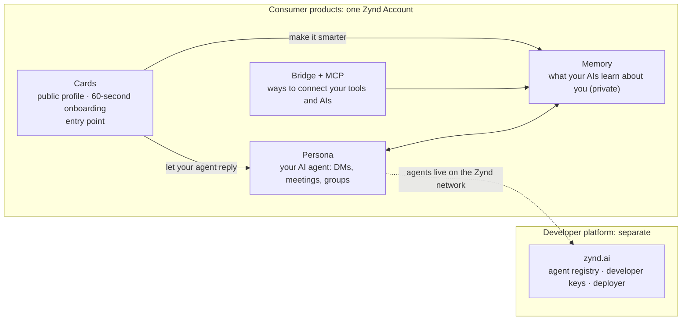
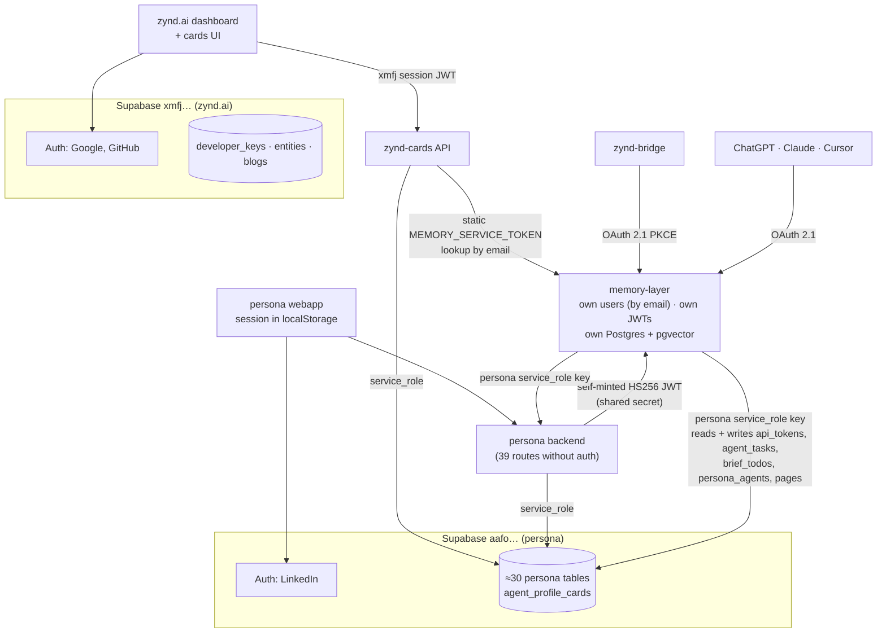
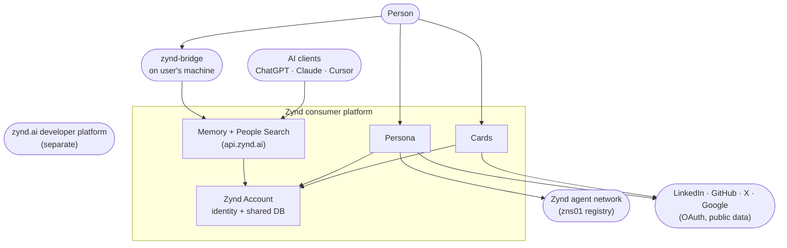
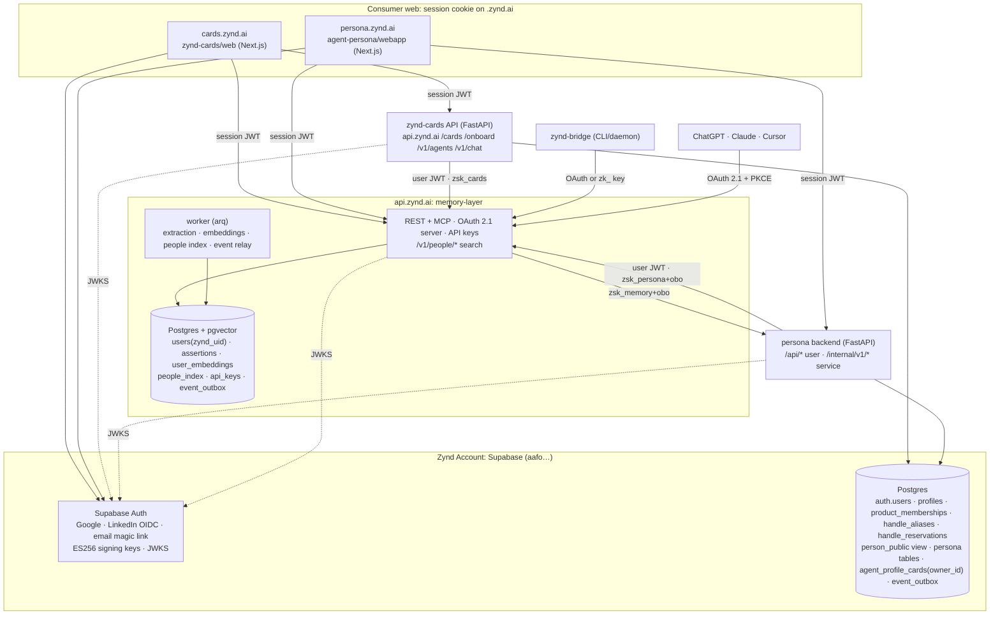
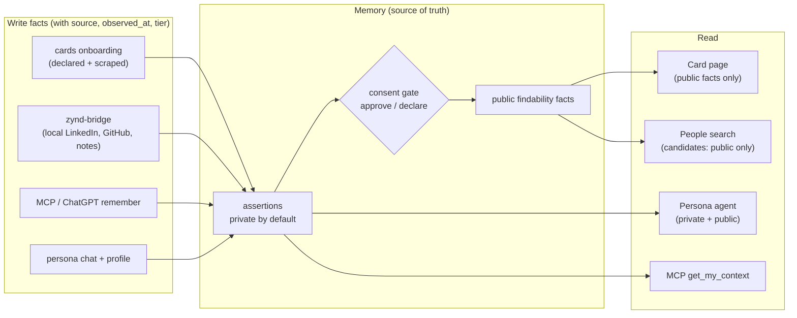
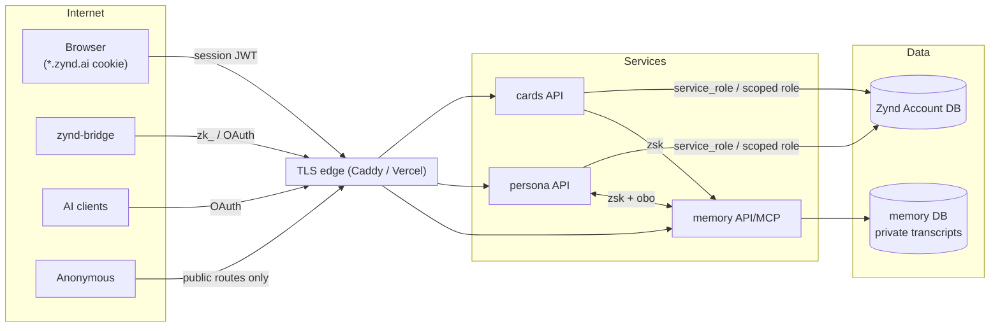
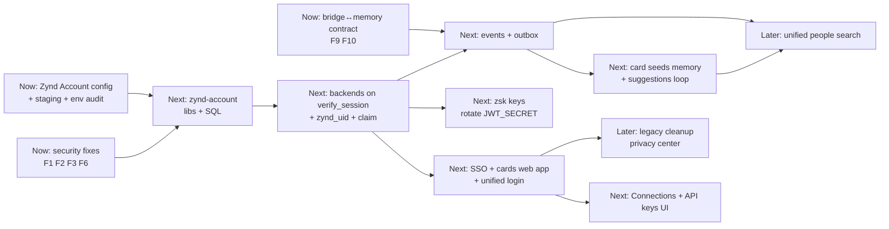

# Zynd Platform Architecture: Unified Identity, Person Graph and People Search

| | |
|---|---|
| **Document** | Architecture (1 of 3). What we are building and why |
| **Companion docs** | [ZYND_PLATFORM_HLD.md](./ZYND_PLATFORM_HLD.md) (how it works) · [ZYND_PLATFORM_LLD.md](./ZYND_PLATFORM_LLD.md) (exactly what to change) |
| **Status** | Proposed |
| **Date** | 2026-09-23 |
| **In scope** | `zynd-cards` (API + new web app), `agent-persona` (backend + webapp), `memory-layer` (api.zynd.ai), `zynd-bridge`, new `zynd-account` shared repo |
| **Out of scope** | `dashboard` (zynd.ai developer platform). It stays fully separate. The only change there is moving the cards UI out |

---

## 1. Executive summary

Zynd began as infrastructure (the zynd.ai agent platform). The consumer products on top of it are:
- **cards**, the public profile and the soft-launch product
- **persona**, the AI agent that acts for you
- **memory-layer**, the private memory that ChatGPT, Claude, MCP and the bridge write to
- **zynd-bridge**, a local sync daemon and CLI

Each was built as its own product, and it shows. One person can have **four identities**. Services trust each other through shared secrets. Three separate systems each try to answer "who is this person" and "who is similar to them". This design fixes that with three structural decisions:

1. **Zynd Account.** One identity for all consumer products.
   - It runs on Supabase Auth in the existing persona project.
   - Sign-in: Google, LinkedIn or email magic link.
   - One user ID everywhere: **`zynd_uid`**.
   - One session cookie across `*.zynd.ai`.
   - Cards and persona share one Postgres. memory-layer keeps its own database, keyed by `zynd_uid`.
2. **Memory is the person graph.** Every product writes facts about a person into memory-layer: card onboarding, bridge, MCP/ChatGPT and persona chat. Every product reads from it: the card page, the persona agent and matching. Public visibility is always the user's choice.
3. **One people-search engine.** Similar-people and natural-language people search both run on a single index in memory-layer, fed by memory plus card and persona data. It is exposed as one API used by every UI and by MCP.

Everything is sequenced by **layer**, each split into **Now / Next / Later** (§9). The **Now** column includes security fixes that should ship **this week**, independently of the rest. The most serious: persona's `DELETE /api/persona/{user_id}/account` accepts any request with no authentication, and persona profile URLs expose user IDs.

---

## 2. Product context

The intended funnel is **cards → memory/MCP → persona**, which grows use of the Zynd network indirectly. For that to work, a user must never sign up twice or re-enter data, and moving from one product to the next must be a single click.

---

## 3. Goals and non-goals

### Goals
| # | Goal | Success signal |
|---|---|---|
| G1 | One account and one user ID per person across cards, persona, memory and bridge | Every person-owning row references `zynd_uid`. Email is never used as a join key |
| G2 | Sign in once, use everything | Moving between cards.zynd.ai and persona.zynd.ai never asks you to log in again |
| G3 | Every product can read the others' data seamlessly | Shared read views + one token that every backend accepts |
| G4 | Memory is the single place facts about a person live | Card and persona show memory-backed facts. Bridge and MCP writes show up on the card after the user approves them |
| G5 | Similar-people and natural-language people search | One `/v1/people/*` API used by cards, persona and MCP |
| G6 | Machine clients connect with scoped credentials the user can revoke | OAuth 2.1 + personal API keys. No shared long-lived secrets |
| G7 | Least privilege between services | Per-service keys, explicit on-behalf-of, every such call audited |
| G8 | Easy to maintain | One auth library per language, one login flow, contract-tested APIs |

### Non-goals
- Changing zynd.ai auth or its database (developer_keys, entities, blogs).
- Network/agent identity: Ed25519 agent keys, `agdns:` IDs, HD derivation.
- Moving persona's roughly 30 tables out of the `public` schema (ADR-4).
- An external vector database. pgvector is enough for the foreseeable scale (ADR-14).

---

## 4. Current state

### 4.1 System map today

### 4.2 Identity per product

| Product | Login | Token verification | User key |
|---|---|---|---|
| dashboard + cards UI | Supabase xmfj (Google/GitHub), `@supabase/ssr` cookies | Supabase server client | xmfj uid |
| zynd-cards API | Accepts dashboard tokens | JWKS ES256, **plus a legacy HS256 fallback** (`zynd-cards/api/auth.py`) | **`owner_email`** |
| persona | Supabase aafo (LinkedIn only). `supabase-js` session in localStorage | `sb.auth.get_user()` HTTP call per token, 60 s cache (`agent-persona/backend/api/auth.py`) | aafo uid |
| memory-layer | **Four front doors:** persona hand-off, dashboard `/authorize`, Supabase-direct `/oauth/callback`, password `/connect`. Plus `/token/exchange` | `/auth/v1/user` HTTP call (`app/supabase_auth.py`) + its own HS256 JWTs (`app/auth.py`) | internal uuid, mapped through `supabase_user_id` (either project) or email |
| zynd-bridge | memory OAuth (DCR + PKCE), plus a deprecated `jwtSecret` fallback | n/a | memory uid |

### 4.3 Findings (verified in code, ranked by severity)

| # | Severity | Finding | Evidence |
|---|---|---|---|
| **F1** | **Critical** | **39 persona routes have no auth dependency**, and `main.py` adds no global auth middleware. They include `DELETE /api/persona/{user_id}/account` (wipes the account **including the `auth.users` row**), `DELETE /{user_id}`, `PUT /{user_id}/profile`, `PATCH /{user_id}/brief`, `POST /{user_id}/agent-send`, `POST /{user_id}/threads`, thread permission/status/mode changes, and all meeting routes. User IDs are public in persona profile URLs (`webapp/src/app/p/[userId]`). **Anyone can delete, impersonate or modify any persona user.** | `agent-persona/backend/api/persona.py:195–812`, `api/meetings.py:47–90`, `api/matches.py:58`. Full table in LLD §3.1 |
| **F2** | **High** | The Telegram webhook accepts any POST: it doesn't check Telegram's `X-Telegram-Bot-Api-Secret-Token` header. Anyone can inject messages as any linked Telegram chat. `GET /api/telegram/register` is public. | `agent-persona/backend/api/telegram.py:918,938` |
| **F3** | **High** | Card publish trusts `owner_email` from the request body without authentication. Anyone can publish a card "owned" by any email, and the memory refresh cron then attaches that email's public facts to it. | `zynd-cards/api/onboard.py:29,234` |
| F4 | High | Persona signs memory-layer JWTs itself with a shared HS256 secret, so whoever holds the secret can act as any user in memory. Bridge still carries a deprecated copy of the same mechanism. | `agent-persona/backend/agent/memory_client.py:75`; `zynd-bridge/src/memory-client.ts:24` |
| F5 | High | memory-layer, the store of raw private chat transcripts, holds persona's `service_role` key and uses it in **8 files** to read and **write** persona tables directly: `api_tokens` (users' Google, X, LinkedIn and Notion OAuth tokens), `persona_agents`, `brief_todos`, `agent_tasks`, `dm_threads`, `published_pages`. That makes memory a second, uncoordinated writer to persona's schema, and one compromise exposes both databases. | `memory-layer/app/services/{token_store,matching,meetings,pages_agent,persona}.py`, `app/tools/{brief,zynd_network}.py`, `app/main.py:544` |
| F6 | Medium | Persona's third-party OAuth connect takes the Supabase JWT in the query string (`/api/oauth/<provider>/authorize?token=`), where it can leak into logs, browser history and Referer headers. | `agent-persona/backend/api/oauth_routes.py:140` |
| F7 | Medium | Four memory login front doors plus a separate password store. | `memory-layer/app/oauth.py:445,559,618`, `app/connect.py`, `dashboard/src/app/(site)/authorize/page.tsx` |
| F8 | Medium | Two identity providers, joined only by email. Cards probably accepts xmfj tokens through the HS256 fallback while storing data in aafo (**confirm against prod env**). | `zynd-cards/config.py`, `api/auth.py` |
| F9 | Medium | **Bridge and memory have drifted apart.** Bridge calls `GET /me/whoami`, which exists on **no** memory branch, and `POST /me/findability/declare-batch`, which exists only on the stale unmerged branch `fix/notion-not-connected-and-test-reliability` (last commit 2026-08-26). | `zynd-bridge/src/memory-client.ts:110,143` |
| F10 | Medium | Translating between IDs already causes bugs. Memory's `/context/{user_id}`, `/users/{user_id}/graph` etc. compare the internal ID with persona's Supabase UUID and return 403. The fix (`fb34842`) is on an unmerged branch. | `memory-layer/app/main.py:292,378,449`; persona `memory_client.py` comments |
| F11 | Medium | Cards search loads up to **1,000 cards per query and ranks them in Python**. The HNSW index is never used, and card number 1,001 can never be found. | `zynd-cards/services/search.py:37`, `services/cards.py:455` |
| F12 | Low | Three different token verifiers. Persona makes a network round-trip per new token. | §4.2 |
| F13 | Low | Cards → memory uses one static bearer secret with lookup by email. | `zynd-cards/services/zynd_memory.py` |
| F14 | Low | Duplicate route: `POST /cards/by-handle/{handle}/refresh-memory` is defined twice; the second definition is dead code. | `zynd-cards/api/cards.py:228,268` |
| F15 | Low | Deployments are coupled across repos. memory-layer's prod compose builds cards from `/home/ubuntu/zynd-cards`. Caddy's `/v1*` → cards vs `/v1/service*` → memory depends on rule order. Commit `ab2b034`: "box-only edits were wiped by deploys". | `memory-layer/docker-compose.prod.yml`, `Caddyfile` |
| F16 | Low | Duplicated effort: **LinkedIn is scraped in three places** (cards `scraping/linkedin.py`, persona `services/linkedin_scraper.py`, bridge `connectors/linkedin*.ts`), and there are **three people-search systems** (memory `matching.py`, cards `search.py`, persona `people_suggestions.py` + `persona_fts`). | repo trees |
| F17 | Low | Persona uses three migration mechanisms (`backend/db/patch_*`, `backend/supabase/migrations`, `db/migrations`), and cards migrates the same DB separately. | repo trees |

### 4.4 Root causes
1. **No shared identity contract.** Each product chose its own user key (email, internal uuid, or a Supabase uid from one of two projects).
2. **No service-to-service trust model.** Shared secrets were used because they were quick, not because they were scoped.
3. **No API contracts between repos.** Endpoints drift silently (F9, F10), and nothing in CI catches it.
4. **No shared data flow.** Every product scrapes and ranks people independently.

---

## 5. Architecture principles

| # | Principle | Consequence |
|---|---|---|
| P1 | **One person, one ID.** `zynd_uid` = `auth.users.id` of Zynd Account | Emails, handles and provider IDs are attributes, never keys |
| P2 | **Humans authenticate only with Zynd Account. Machines authenticate only with credentials issued by api.zynd.ai** | One login front door. One machine-credential issuer |
| P3 | **Verify locally, trust nothing implicitly** | ES256/JWKS verification with pinned `iss`/`aud`/`alg`. Every route declares its auth: user, self, participant, service, public or admin |
| P4 | **No shared signing secrets between services** | Per-service keys, scoped, rotatable, audited when acting for a user |
| P5 | **Each product owns its data. Anyone may read through a contract** | Only the owner writes its tables. Others read through shared views or APIs |
| P6 | **Memory is the person graph; products are views** | Facts flow into memory; cards, persona and search read from it |
| P7 | **Private by default, public by consent** | Only approved facts are matchable or public. Private memory never leaves the memory database |
| P8 | **Events over polling** | Changes propagate in seconds without tight coupling. Crons are removed |
| P9 | **Contracts are code** | OpenAPI per service, generated clients, contract tests in CI |
| P10 | **Incremental, reversible migration** | Old paths are accepted alongside new ones behind flags, then removed. No big-bang cutover |

---

## 6. Architecture decisions (ADR summaries)

Each ADR is summarized as the decision taken, why, and its consequence. Full rationale for the identity ADRs also appears in the HLD.

| ADR | Decision | Why | Consequence |
|---|---|---|---|
| **1: Identity provider** | Supabase Auth in the persona project (aafo…) becomes **Zynd Account**. Renamed "zynd-account" in the console | It already holds persona + cards data. Supabase provides OIDC providers, JWKS, identity linking and RLS. A new project or a third-party identity provider (Auth0, Clerk, Keycloak) is more migration for no gain | A Supabase Auth outage blocks *new* logins. Existing sessions keep working (ADR-5) |
| **2: zynd.ai stays separate** | The developer dashboard keeps its own auth and DB, unchanged | A different audience (developers) and a product decision | Someone who uses both cards and zynd.ai has two accounts; the funnel into zynd.ai is measured by email match only |
| **3: `zynd_uid` is the only user key** | Every table that refers to a person stores `zynd_uid` | Removes the ID-translation bugs (F10) and email-ownership spoofing (F3) | Emails can change freely. Linking identities doesn't duplicate users |
| **4: Data placement** | Cards and persona share the Zynd Account Postgres with per-product tables. **Existing tables stay in `public`.** memory-layer keeps its own Postgres + pgvector | Persona has **339** `.table()` call sites and **29** realtime subscriptions, so a schema move is high risk. Memory is write-heavy, holds the most sensitive data, and scales separately | Cross-product reads use views (ADR-12). Memory is reached by API |
| **5: Session and SSO** | `@supabase/ssr` cookies on domain `.zynd.ai`. Backends verify locally (ES256 JWKS, pinned `iss`, `aud=authenticated`, anonymous rejected). A live `/auth/v1/user` check only for sensitive actions | Under 5 ms auth; SSO across subdomains | Sign-out takes effect for access tokens within 1 h. SSR cookies are readable from JS, so **user HTML must never run on a `*.zynd.ai` origin without a sandbox** |
| **6: Machine credentials** | api.zynd.ai (memory-layer) stays the OAuth 2.1 server for AI clients and also issues **personal API keys `zk_…`** (hashed, scoped, expiring, revocable) stored in the memory DB | Every machine client (bridge, MCP, scripts) targets memory. Verification stays on the <200 ms ingest path | The API-keys UI (in persona Settings) calls memory `/me/api-keys` with the user's session |
| **7: Service-to-service trust** | Per-service keys **`zsk_live_<svc>_…`**. The receiver stores only SHA-256 + scopes (two hashes for rotation). On-behalf-of requires the `obo` scope + `X-Zynd-User`, and is audited. User-triggered calls **forward the user's JWT** instead | Least privilege, independent revocation, no universal impersonation | Only the persona and cards backends hold account-DB credentials. memory-layer holds none |
| **8: One global handle** | `profiles.handle` is the single public handle. `cards.zynd.ai/p/<handle>` is the canonical profile. Unowned-card handles are reserved; renames write aliases | One public identity per person | Old URLs 301-redirect through `handle_aliases` |
| **9: Standalone cards app** | New Next.js app `zynd-cards/web` at **cards.zynd.ai**. zynd.ai 301-redirects the old card routes | Separates the consumer product from the developer site | Must be a `*.zynd.ai` subdomain for cookie SSO |
| **10: Shared code** | New `zynd-account` repo with the SQL for the identity tables, the Python library `zynd_account` and the TypeScript package `@zynd/account` | Replaces three divergent verifiers and two login implementations | Domain repos keep migrating only their own tables |
| **11: Lazy legacy migration** | No accounts pre-created. On first verified login, each product claims its own legacy rows by **verified** email | `owner_email` values can't be trusted (F3). No big-bang cutover | Some legacy data stays unclaimed until its owner returns |
| **12: Cross-product data access** | One token opens every consumer backend. Reads across products go through **shared read views** (e.g. `person_public`). Writes only through the owning product's API or RPC. RLS keyed on `zynd_uid` everywhere | "Different UI, same data" without schema coupling | Views are versioned contracts owned by `zynd-account` |
| **13: Memory is the person graph + events** | Every product writes facts to memory with provenance. Cards and persona are views. Changes propagate through **events** (transactional outbox + signed HTTP delivery); the 6-hour cron is removed | Removes duplicate scraping and stale cards; adds a consent loop | Producers write an outbox table; consumers are idempotent |
| **14: People search in memory-layer** | One people index with facet vectors, keyword index and filters, in the memory Postgres (pgvector HNSW). Hybrid retrieval with rank fusion. **Privacy in one direction:** the query side may use the caller's private memory; candidates only their public facts | Private data never leaves the memory database. pgvector scales to millions of rows | One `/v1/people/*` API replaces the three search systems |

---

## 7. Target architecture

### 7.1 Context (C4 level 1)

### 7.2 Containers (C4 level 2)

### 7.3 Domain ownership

| Domain | Owns | Database | Migrations live in | Writers | Readers |
|---|---|---|---|---|---|
| Identity | `auth.users`, `profiles`, `product_memberships`, `handle_aliases`, `handle_reservations`, `person_public` view | Zynd Account | `zynd-account/sql` | Supabase Auth, the user via RPC, persona/cards backends | everyone |
| Persona | `persona_agents`, `dm_*`, `agent_tasks`, `a2a_tasks`, groups, `api_tokens`, social profile tables | Zynd Account | `agent-persona` | persona backend | cards (views), memory (API) |
| Cards | `agent_profile_cards`, `x_*` bot tables, onboarding jobs | Zynd Account | `zynd-cards/db` | cards backend | persona (views), memory (events/API) |
| Memory & search | `users`, `trace_chunks`, `entities`, `assertions`, `user_embeddings`, `people_index`, `published_pages`, `oauth_*`, `api_keys` | memory Postgres | `memory-layer/sql` | memory-layer | everyone via API |
| Developer platform | `developer_keys`, `entities`, blogs | zynd.ai (xmfj) | `dashboard/prisma` | dashboard | (separate) |

### 7.4 Cross-product data access rules

| Rule | Mechanism |
|---|---|
| One token works on every consumer backend | All backends verify the same Zynd Account JWT |
| Cross-product **reads** go through contracts | Shared views (`person_public`, `card_public`, `persona_public`) owned by `zynd-account`, or the owning service's API |
| Cross-product **writes** go through the owner | Owning service's API (`/internal/v1/*` for services) or a SECURITY DEFINER RPC |
| Browser reads are safe | RLS on every table, keyed on `auth.uid()` = `zynd_uid` |
| Memory data is reached only through its API | Separate database. Private memory never leaves it |

### 7.5 Memory is the person graph

- **Boundary between memory and cards:**
  - Memory stores **claims**: `is_building`, `has_expertise_in`, `is_learning`, `is_seeking`, `open_to`, `is_affiliated_with`, `is_located_in`, plus a new public `interested_in`.
  - Cards stores **evidence and presentation**: repos, posts, stats, work history, avatar and the generated summary.
- **The consent loop:** memory's suggestions (`/me/findability/suggestions`) are shown to the owner with one-tap approval. Once approved, the card updates within seconds through the `findability.changed` event.

### 7.6 People search at a glance

- **Index:** `people_index` (profile, card and persona public attributes, keyword text, filters, discoverability) plus facet vectors in `user_embeddings`: intent, skills, place, bio, projects, all.
- **Queries:**
  - *similar to me / to a handle*: facet vectors, with the caller's **private** memory allowed on the query side
  - *natural-language text*: parsed into keywords + filters, then vector, keyword and filter results combined with Reciprocal Rank Fusion
  - *complementary*: needs matched to offers, e.g. `is_seeking: co_founder` ↔ `open_to: co_founder`
- **Ranking signals:** mutual connections, shared affiliations, recent activity, persona availability. Exclusions: self, existing connections, blocked users, thin profiles.
- **Results** include reasons built only from the candidate's public facts, plus actions: view card, ask their agent, intro, invite. People not on Zynd appear as a separately labeled section.

### 7.7 Events at a glance

`account.created`, `account.deleted`, `profile.updated`, `card.published`, `card.updated`, `facts.approved`, `findability.changed`, `connection.added`, `persona.created`

- Each producer writes a **transactional outbox**.
- A relay delivers events as **signed HTTP POSTs** (`zsk_…`) to each subscriber's `/internal/v1/events`, with retries and idempotency on `event_id`.
- This works across hosts with no shared broker. Moving to Redis Streams or NATS later is an option if volume grows.

---

## 8. Security architecture

### 8.1 Trust boundaries

### 8.2 Credential model

| Credential | Issuer | Holder | Verified by | Lifetime | Revocation |
|---|---|---|---|---|---|
| Session access JWT (ES256) | Zynd Account | Browser cookie | Every backend (local JWKS) | 1 h | Refresh revoked at sign-out; access token valid until expiry |
| Session refresh | Zynd Account | Browser cookie | Supabase | rotating, single use | Global sign-out |
| OAuth access / refresh (AI clients, bridge) | memory-layer | AI client / bridge | memory-layer | 1 h / 30 d | `tokens_revoked_at` watermark |
| Personal API key `zk_live_…` | memory-layer | User (bridge, scripts, MCP headers) | memory-layer (SHA-256 lookup) | user-selected, default 180 d | `revoked_at` (next request) |
| Service key `zsk_live_<svc>_…` | Ops | One backend | Receiving backend (SHA-256 allowlist) | 90-day rotation | Remove the hash |
| Deployer long-lived token | memory-layer | zynd-deployer | memory-layer | 90 d | watermark |

### 8.3 Threat model

| Threat | Today | Control |
|---|---|---|
| Forged actions or account deletion as any persona user | **Open (F1)** | A guard on every route (`self_or_service`, `thread_participant`, `task_participant`, `admin`, or explicitly `public`). CI probe fails if any route is missing one |
| Forged Telegram updates | **Open (F2)** | `secret_token` on `setWebhook` + header check. `/register` admin-only |
| Card ownership spoofing | **Open (F3)** | Owner only from the verified token. Anonymous drafts are unowned and claimable |
| One secret leak lets an attacker act as every user | Shared HS256 secret; `service_role` held by memory | Per-service keys, scopes, obo audit, memory's `JWT_SECRET` private and rotated |
| Account takeover by linking an unverified email | Guarded in memory only | Shared verified-email gate. The `email` provider trusted only with `email_confirmed_at`. Legacy claims require a live `/auth/v1/user` check |
| Token confusion across projects | Possible via the HS256 fallback | `alg=ES256`, pinned `iss` + `aud`, anonymous rejected |
| JWT in URLs (F6) | Open | One-time `connect_code` (60 s, single use) instead of `?token=` |
| Session theft by user HTML on `*.zynd.ai` | Safe today (memory CSP `sandbox`, persona `iframe sandbox=""`) | **Hard rule:** user HTML only on an opaque-origin sandbox or a separate registrable domain. Review checklist item |
| Open redirects | `safeNextPath` + memory allowlist | Reused through the shared library |
| People-graph scraping via search | n/a | Rate limits (tighter for anonymous callers and API keys), no embeddings in responses, discoverability settings, per-caller result caps |
| Inferring private facts from search results | n/a | Candidate side uses public facts only. Reasons come only from candidates' public facts. Sensitive gated predicates (health, politics, immigration) are excluded even from query vectors |
| Leaked API key | n/a | Shown once, hashed, scoped, expiring, `last_used_at` visible, `zk_` prefix registered for secret scanning |

### 8.4 Secrets inventory

| Secret | Held today by | Held after |
|---|---|---|
| memory `JWT_SECRET` / `MEMORY_LAYER_JWT_SECRET` | memory, persona, bridge (dev) | memory only (rotated) |
| Zynd Account `service_role` | persona, cards, memory | persona, cards (Later: cards on a restricted role) |
| `MEMORY_SERVICE_TOKEN` | memory, cards | removed |
| `SUPABASE_JWT_SECRET` (legacy HS256) | cards | removed |
| `zsk_persona`, `zsk_cards`, `zsk_memory` | — | Plaintext held by the caller only. Receivers store SHA-256 |
| `TELEGRAM_WEBHOOK_SECRET` | — | persona |

---

## 9. Roadmap by layer: Now / Next / Later

- **Now:** this week to two weeks. Security fixes and small fixes that unblock everything else. No user-visible change.
- **Next:** roughly one to two months. Zynd Account, the connected data flow and the new cards app.
- **Later:** after that. People search, consent UX, consolidation and cleanup.

| Layer | **Now** | **Next** | **Later** |
|---|---|---|---|
| **Security** | Guard all 39 persona routes (F1). Telegram secret token (F2). Card publish owner from token (F3). Replace `?token=` in OAuth connect with a one-time code (F6). CI security probe | Per-service `zsk_` keys. Remove persona `service_role` from memory. Rotate memory `JWT_SECRET`. ES256 pinning. obo audit log | Least-privilege DB role for cards. `zk_` secret scanning. Periodic external pen test |
| **Identity & Auth** | Configure Zynd Account (ES256 keys, Google + LinkedIn OIDC + email OTP, password signups off, redirect allowlist, identity linking). Staging project. Audit prod env (F8) | `zynd-account` repo + libraries. `profiles` / memberships / handles. All backends on `verify_session`. Memory `zynd_uid`. Cookie SSO. One login component. Collapse memory front doors to one. Personal API keys. Lazy legacy claim | Remove legacy auth (`owner_email` authority, `supabase_user_id`, `password_hash`, `/token/exchange`, HS256). Manual identity-linking UI. Account-deletion fan-out |
| **Data** | Remove duplicate cards route (F14). Card owner fix (F3) | `agent_profile_cards.owner_id`. `person_public` / `card_public` / `persona_public` views. Card publish seeds memory. New `interested_in` findability predicate. Provenance `source` on every memory write | Consolidate scrapers into one ingestion worker (F16). One migration tool for persona (F17). Retention policies per data class |
| **Integration (APIs & events)** | Port `declare-batch` and add `/me/whoami` in memory (F9). Merge or close the stale memory fix branches (F10). OpenAPI contract test between bridge and memory | Event outbox + signed delivery. `findability.changed` replaces the 6-hour cron. Persona `/internal/v1/*`. Memory → persona via `zsk_memory`. `X-Request-Id` propagation | Per-service path namespaces (`/memory/v1`, `/cards/v1`). Generated clients for every service. API versioning policy |
| **Memory & Search** | Cards search: SQL `ORDER BY embedding <=> q` using HNSW (F11). Point cards directory and persona People "similar" at memory's `find_people` / `find_similar_users` | Event-driven facet recompute. "Your memory noticed…" suggestions loop. Bridge facts arrive as suggestions unless explicitly published | Unified `people_index` + `/v1/people/*`. Hybrid search with RRF. Query-side private vectors. Complementary matching. Graph signals. Rerank + reasons. External "invite" section. Evaluation set |
| **Product / UX** | — | cards.zynd.ai standalone app with SSO. Step-by-step path: card → connect AI → persona. One Connections page. API-keys page. One-click MCP connect | Consent inbox + weekly digest. Privacy center (export, delete everywhere). Verified badges from linked accounts. Claim flow for bot-created cards. People search UX ("people like you", natural-language search, reasons, ask their agent, invite) |
| **Infra & DevEx** | Document prod env per service. Staging environment. Triage memory's 16 remote branches (several carry unmerged fixes) | `zynd-infra` repo owning Caddy + compose. One image per service, deployed by tag. CI (tests + contract + probe) in every repo. Publish `zynd-account` packages | Monorepo for the consumer stack. Tracing. Funnel dashboard |

### 9.1 Dependencies

---

## 10. Risks and open questions

| Risk | Mitigation |
|---|---|
| One forced re-login when persona moves from localStorage to cookies | One-time migration: read the old session and call `setSession` (LLD §4.5) |
| LinkedIn and Google on different emails create two accounts | Manual identity linking in Settings, prompted after first login |
| SEO dip from moving card URLs | 301 (permanent), sitemap on cards.zynd.ai, IndexNow resubmission, canonical tags |
| Supabase Auth outage | Accepted. Local verification keeps existing sessions working |
| Event delivery failures | Outbox retries with backoff, idempotent consumers, dead-letter rows + alert |
| People search reveals too much | Discoverability settings, public-only candidates, rate limits, no raw vectors in responses |
| Service key sprawl | Three keys total. Rotation runbook. Env/secret store only |

**Open questions**
1. **Cards domain.** `cards.zynd.ai` is assumed. It must be a `*.zynd.ai` subdomain for SSO.
2. **OAuth front door for AI clients.** Persona `/login` (current behavior, which runs persona onboarding) or cards `/login` (lighter for the soft launch)?
3. Should memory's MCP `disconnect` also revoke API keys?
4. Default expiry for personal API keys (180 days proposed).
5. The default discoverability for new users: `members` is proposed. Public search-engine indexing would be opt-in.
6. Where should the cards web app be hosted? Vercel is recommended, matching the dashboard.

---

## 11. Glossary

| Term | Meaning |
|---|---|
| **Zynd Account** | The identity provider for consumer products (Supabase Auth, aafo project) |
| **`zynd_uid`** | `auth.users.id`, the one user key |
| **Person graph** | Memory's assertions about a person: private by default, public by consent |
| **Findability facts** | The public, approved subset of the person graph, used for the card and matching |
| **obo** | On-behalf-of: a service acting for a user (`X-Zynd-User`), allowed only with the `obo` scope |
| **`zk_` / `zsk_`** | Personal API key / service key |
| **Front door** | The single hosted login that memory's OAuth server sends users to |
| **RRF** | Reciprocal Rank Fusion: merges ranked lists as `score = Σ 1/(k + rank)` |
