# Zynd Platform: High-Level Design (HLD)

| | |
|---|---|
| **Document** | HLD (2 of 3). How the system works: components, auth flows, data flows, search, events, deployment |
| **Read with** | [ZYND_PLATFORM_ARCHITECTURE.md](./ZYND_PLATFORM_ARCHITECTURE.md) (decisions) · [ZYND_PLATFORM_LLD.md](./ZYND_PLATFORM_LLD.md) (code-level changes) |
| **Status** | Proposed · 2026-09-23 |

---

## 1. Scope and reading guide

This document describes the **target** system and the **transitions** that get there. Every change is tagged with its phase: **Now** (security and blockers), **Next** (Zynd Account and the connected data flow) or **Later** (people search, consent UX, consolidation).

- §3 covers each product: what it does and what changes.
- §4–5 cover identity and **every auth flow**.
- §6 covers data flows between products.
- §7 covers people search.
- §8 covers events.
- §9–11 cover APIs, deployment and non-functional requirements.
- §12 covers rollout.

---

## 2. System overview

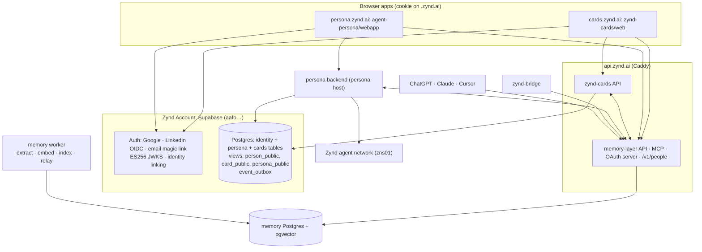

---

## 3. Components and responsibilities

### 3.1 `zynd-account` (new repo, **Next**)

| Part | Responsibility |
|---|---|
| `sql/` | Tables `profiles`, `product_memberships`, `handle_aliases`, `handle_reservations`. Trigger on `auth.users`. RPCs `set_handle`, `adopt_handle`. Views `person_public`, `card_public`, `persona_public`. RLS. Applied before any product migrations |
| `py/zynd_account` | `verify_session` (JWKS ES256), FastAPI dependencies (`current_user`, `optional_user`, `require_self_or_service`, `service_caller`), `service_headers`, `touch_membership`, `fetch_verified_identity` (live check for sensitive actions), key hashing helpers, event outbox helper |
| `ts/@zynd/account` | Browser and server Supabase clients with cookie domain `.zynd.ai`, `ZyndAccountProvider` / `useZyndAccount`, `<ZyndLogin/>`, `/auth/callback` handler, `safeNextPath`, `getZyndUser()` |

### 3.2 zynd-cards API (`zynd-cards/`, FastAPI, api.zynd.ai `/cards`, `/onboard`, `/ask`, `/v1/agents`, `/v1/chat`)

| Phase | Change |
|---|---|
| **Now** | Publish takes its owner from the verified token (F3). Remove the duplicate `refresh-memory` route (F14). Search uses SQL/HNSW instead of the Python scan (F11) |
| **Next** | `zynd_account.current_user` replaces `api/auth.py` (drops HS256). Ownership moves to `owner_id`. Legacy claim on first sight. Card publish seeds memory. Consume `findability.changed` instead of the 6-hour cron. Emit `card.published` / `card.updated`. Reserve handles for unowned cards |
| **Later** | Scraping moves to the shared ingestion worker. Directory and search call `/v1/people/*` |

### 3.3 zynd-cards web (`zynd-cards/web`, Next.js, **cards.zynd.ai**, **Next**)

- Port from the dashboard: `create`, `p/[handle]` (incl. `edit`, `data.json`), `profile/[id]`, `directory`, `find`, `search`, `tag/[skill]`, `agent-card` landing, `lib/cards.ts`, `hooks/useMyCard.ts`.
- Auth comes from `@zynd/account`. The login offers Google, LinkedIn and email.
- The canonical public profile is `/p/<handle>`. It shows a "Talk to my persona" section when the person has an active persona.
- The owner's view shows memory suggestions ("Your memory noticed…"), plus links to Connections and to persona.

### 3.4 persona backend (`agent-persona/backend`, FastAPI, persona host)

| Phase | Change |
|---|---|
| **Now** | Guards on all 39 unauthenticated routes (F1). Telegram webhook secret + admin-only `/register` (F2). A one-time `connect_code` replaces `?token=` in third-party OAuth connect (F6) |
| **Next** | `get_current_user` wraps `zynd_account.current_user` (local JWKS; the 60 s cache is dropped). Memory client forwards the user's JWT, or uses `zsk_persona` + obo for background work (`MEMORY_LAYER_JWT_SECRET` removed). `/internal/v1/*` endpoints for memory. Membership touches. Emits `persona.created` / `profile.updated`. Consumes `account.deleted` |
| **Later** | People page reads `/v1/people/*`. QuickEnrich becomes the "external people" tier of search. Scrapers move to the ingestion worker |

### 3.5 persona webapp (`agent-persona/webapp`, Next.js, persona.zynd.ai)

| Phase | Change |
|---|---|
| **Next** | `getSupabase()` returns the `@zynd/account` cookie client (the 28 call sites stay unchanged). Old localStorage sessions are migrated once. Unified login (Google, LinkedIn, email). `/auth/callback` route. `zynd-oauth.ts` stays as the front door for AI clients. **Settings → Connections** and **Settings → API keys** pages. `/p/[userId]` 301-redirects to `cards.zynd.ai/p/<handle>`. Onboarding is pre-filled from the card and memory |
| **Later** | Consent inbox, privacy center, "people like you" |

### 3.6 memory-layer (`memory-layer/`, api.zynd.ai: `api` :8000, `mcp` :8090, `worker`, Postgres + pgvector, Redis)

| Phase | Change |
|---|---|
| **Now** | Port `POST /me/findability/declare-batch` from the stale branch and add `GET /me/whoami` (F9). Merge the ID-canonicalization fix `fb34842` or supersede it (F10) |
| **Next** | Unified credential resolver in `current_user` + `ZyndTokenVerifier`: session JWT, own OAuth JWT, `zk_`, `zsk_`+obo. `users.zynd_uid`. Tokens issued with `sub = zynd_uid`. `/me/api-keys`. One front door (`ZYND_LOGIN_URL`); remove `/connect`, `/oauth/callback`, `/token/exchange`. Findability by `zynd_uid` with `zsk_cards`. **Stop accessing persona tables directly.** Today memory reads and writes `api_tokens`, `persona_agents`, `brief_todos`, `agent_tasks`, `dm_threads` and `published_pages` with persona's `service_role` key in 8 files. Each use moves to a persona `/internal/v1/*` endpoint called with `zsk_memory`: a token broker for third-party OAuth tokens, plus meetings, brief/todos, pages, connections and people batch (LLD §4.6.5). Then remove `supabase_service_key`. Rotate `JWT_SECRET`. Event outbox (`findability.changed`, `facts.approved`) and event consumer (`card.published`, `profile.updated`, `account.deleted`). Provenance `source` on writes. `interested_in` predicate |
| **Later** | `people_index` + `/v1/people/*` (hybrid search, RRF, query-side private vectors, complementary matching, reasons). Ingestion worker for consolidated scraping |

### 3.7 zynd-bridge (`zynd-bridge/`, npm `@zynd/bridge`, CLI `zynd`)

| Phase | Change |
|---|---|
| **Now** | Contract test against memory's OpenAPI. Degrade gracefully if `declare-batch` / `whoami` return 404 |
| **Next** | `zynd login` (existing loopback OAuth, now one click thanks to SSO) plus `zynd login --api-key` / `ZYND_API_KEY` for headless machines. Remove the `jwtSecret` / `userId` fallback. Send provenance (`source: "bridge:<connector>"`). Facts go in as **suggestions** by default; `--publish` declares them public explicitly. `zynd card` shows the real card (cards API) plus the public facts |
| **Later** | Keep only the connectors that must run locally (logged-in LinkedIn network, Obsidian, private notes). Public-profile scraping moves to the server ingestion worker |

### 3.8 dashboard (zynd.ai), **Next**, removal only

- Delete the cards routes, `(site)/authorize`, `useMyCard`, the card lookup in `auth/callback`, and the card nav in `Navbar` / `sidebar`.
- Add `next.config.ts` 301s to cards.zynd.ai.
- **Keep** the registry's A2A "agent card" features (a different concept that happens to share the word).
- Leave the dashboard's DB and auth unchanged.

---

## 4. Identity model

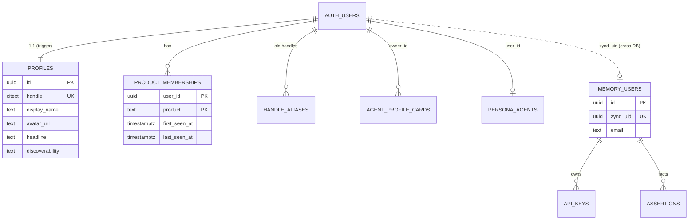

- **`zynd_uid`** is the key in every product. memory-layer keeps its internal `users.id` as the primary key and maps it 1:1 through `zynd_uid`, so no foreign keys are rewritten and issued tokens stay valid.
- **The product with the earliest `first_seen_at`** is the user's signup product. It is derived, not stored.
- **Handles:**
  - format `[a-z0-9][a-z0-9-]{1,38}[a-z0-9]`, case-insensitive, with reserved words blocked
  - reserved for unowned cards through `handle_reservations`
  - renames write `handle_aliases`, which drive 301 redirects

---

## 5. Auth flows

### 5.1 How a backend resolves a credential (all consumer backends)

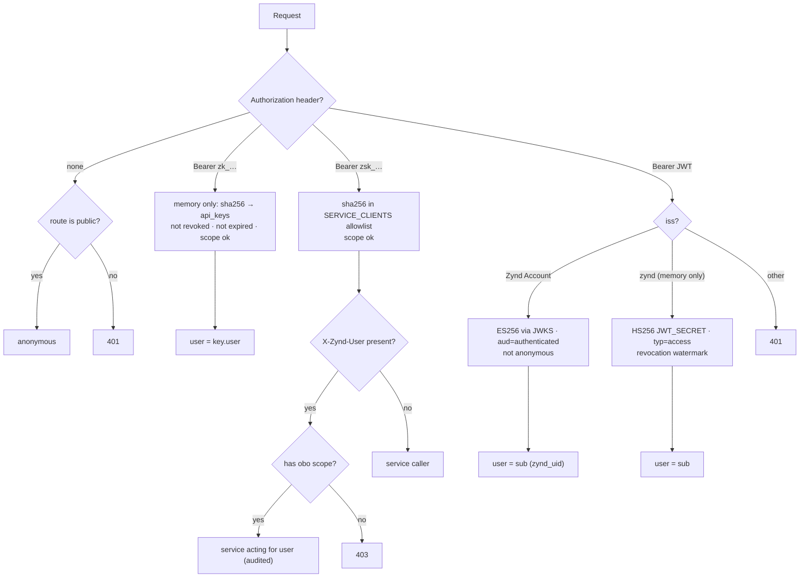

**Route guards.** Every route declares exactly one of:
- `public`
- `user`: any signed-in user
- `self(user_id)`: the path user must equal the caller
- `self_or_service(user_id, scopes)`
- `participant(thread|task)`
- `service(scopes)`
- `admin`

A CI probe fails if any route is missing a declaration (LLD §10.3).

### 5.2 Web sign-up and SSO: cards → persona (**Next**)

```mermaid
sequenceDiagram
  autonumber
  actor U as User
  participant C as cards.zynd.ai
  participant A as Zynd Account Auth
  participant CA as cards API
  participant DB as Zynd Account DB
  participant P as persona.zynd.ai
  participant PB as persona API
  U->>C: Continue with Google / LinkedIn / email
  C->>A: signInWithOAuth (PKCE) or signInWithOtp
  A-->>C: /auth/callback?code=…
  C->>A: exchangeCodeForSession
  A->>DB: INSERT auth.users → trigger INSERT profiles
  C-->>U: Set-Cookie sb-<ref>-auth-token (Domain=.zynd.ai; Secure; SameSite=Lax)
  U->>CA: GET /cards/mine (Bearer JWT)
  CA->>CA: verify_session (cached JWKS) → zynd_uid
  CA->>DB: touch_membership(cards) → first sight → claim legacy cards
  U->>P: open persona.zynd.ai
  P->>P: cookie present → session (no login prompt)
  P->>PB: GET /api/persona/me (same JWT)
  PB->>DB: touch_membership(persona) · prefill onboarding from card_public
```

### 5.3 Email magic link (**Next**)

1. `signInWithOtp({ email, options: { emailRedirectTo: <app>/auth/callback } })`
2. The user clicks the link, which leads to `/auth/callback?code=…`, which calls `exchangeCodeForSession`.
3. `email_confirmed_at` is set, so the email counts as **verified** for linking and legacy claims.
4. Supabase links the email identity automatically to an existing Google or LinkedIn identity with the same verified email.

### 5.4 Legacy claim on first sight (**Next**)

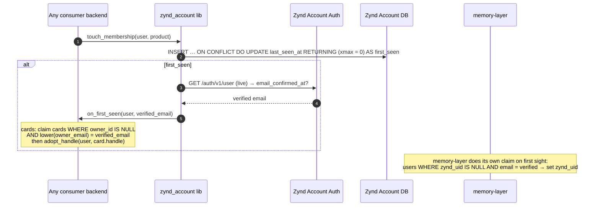

### 5.5 AI clients over OAuth 2.1 (ChatGPT, Claude, Cursor) (**Next**)

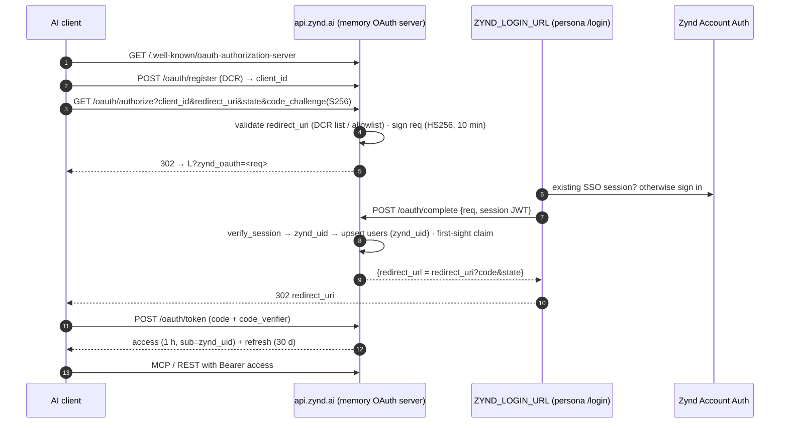

Removed: the dashboard `/authorize` hand-off, memory's `/oauth/callback` HTML page (Supabase-direct flow), password `/connect`, and `/token/exchange`.

### 5.6 zynd-bridge (**Next**)

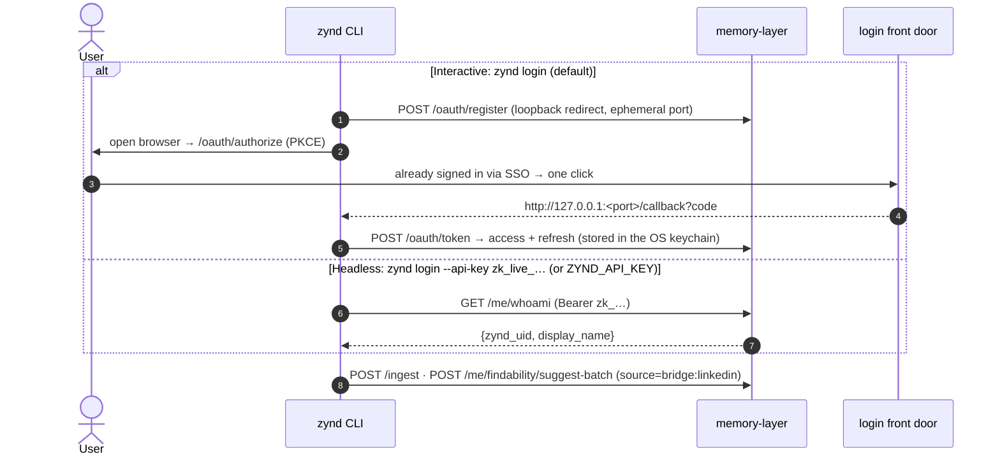

### 5.7 MCP clients that can't do OAuth (**Next**)

Some clients only support a static header, for example `Authorization: Bearer zk_live_…` in an MCP config. `ZyndTokenVerifier` resolves `zk_` keys the same way as REST (§5.1). The scopes `memory.read` / `memory.write` limit which tools the key can call.

### 5.8 Service to service (**Next**)

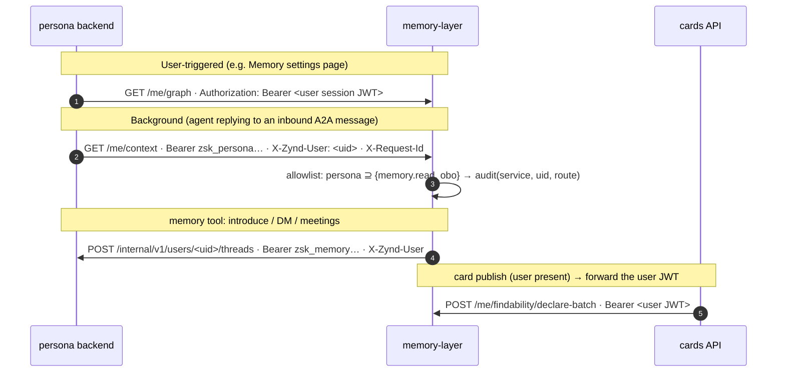

### 5.9 Sign-out and revocation

| Action | Effect |
|---|---|
| Sign out (web) | `supabase.auth.signOut({ scope: 'global' })` revokes all refresh tokens. The cookie is cleared on `.zynd.ai`, so cards and persona both sign out. Access JWTs expire within 1 h |
| MCP `disconnect` / memory `/me/logout` | Sets memory's `tokens_revoked_at`, which kills all memory OAuth tokens. API keys are unaffected (open question) |
| Revoke an API key | Sets `revoked_at`; takes effect on the next request |
| Rotate a service key | Add the new hash → deploy the caller with the new key → remove the old hash |

### 5.10 Account deletion fan-out (**Next**)

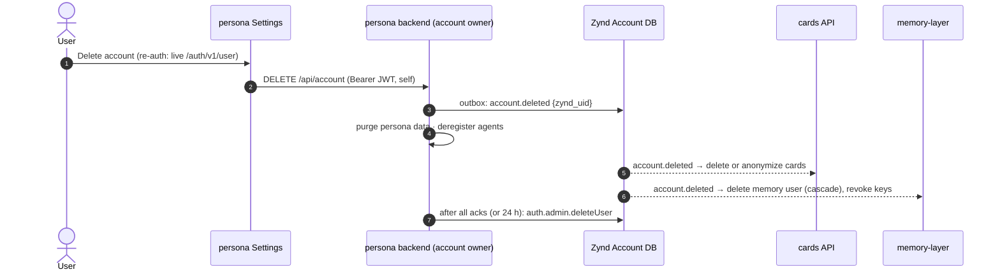

---

## 6. Data flows

### 6.1 Card publish seeds memory (**Next**)

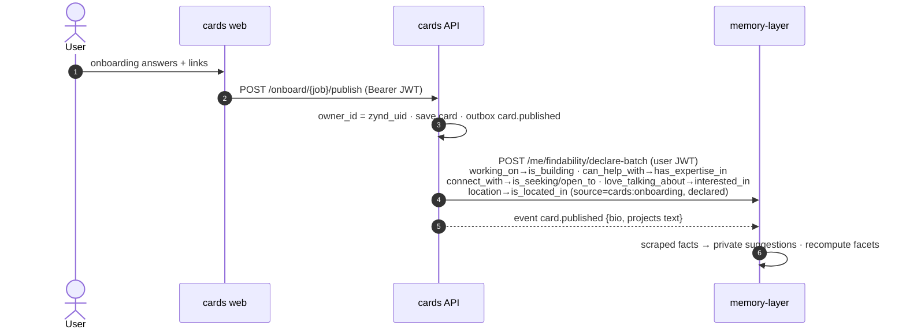

**Card section ↔ memory predicate mapping**

| Card field | Memory predicate | Visibility when seeded |
|---|---|---|
| `working_on` | `is_building` | public (the user declared it on a public card) |
| `can_help_with` | `has_expertise_in` | public |
| `connect_with` | `is_seeking` / `open_to` (enum-mapped) | public |
| `love_talking_about` | `interested_in` (**new**) | public |
| `identity.location` | `is_located_in` | public |
| `industries`, `affiliations` | `is_affiliated_with` | public |
| scraped skills, repos, posts | `has_expertise_in`, `is_building` | **private suggestions** |

### 6.2 Memory → card, driven by events (**Next**)

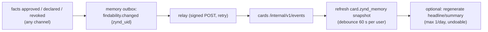

The 6-hour `memory_refresh_loop` in `zynd-cards/main.py` is removed once the event path has run for 7 days without gaps.

### 6.3 "Your memory noticed…" suggestions loop (**Next**)

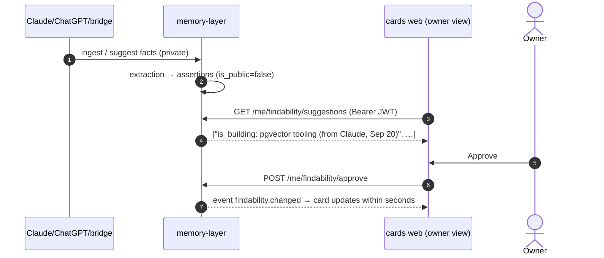

A weekly digest (email or Telegram) shows the same suggestions to users who don't visit.

### 6.4 Bridge and MCP writes (**Next**)

| Rule | Detail |
|---|---|
| One write contract | `POST /ingest` (raw text), `POST /me/findability/declare-batch` (explicit public), `POST /me/findability/suggest-batch` (**new**, private suggestions), `POST /me/memory/declare` (private fact) |
| Provenance | Every write carries a `source` (`bridge:linkedin`, `bridge:github`, `mcp:claude`, `gpt`, `cards:onboarding`, `persona:chat`) and `observed_at`. The UI shows "learned from X on date" |
| Privacy tiers | One taxonomy (memory's `app/taxonomy.py` is the source; the TypeScript copy is generated for bridge). Tier 3 never leaves the device (bridge's `redactor.assertEgressClean`) |
| Consent | Bridge's distilled facts arrive as **suggestions**, not public declarations, unless the user passes `--publish` |
| Dedup | Entity resolution + Bayesian update: the same fact from several sources raises confidence and never duplicates rows |

### 6.5 Consolidated scraping (**Later**)

Today LinkedIn is scraped three times and GitHub twice. Target:

| Source | Where it runs | Output |
|---|---|---|
| Public LinkedIn / GitHub / X / website / resume | **One ingestion worker** (the memory worker queue, fed by cards onboarding and persona connections) | Raw evidence goes to cards (for presentation); facts go to memory as private suggestions |
| Logged-in LinkedIn network, Obsidian, private notes | **zynd-bridge only** (local-first) | Facts go to memory, tier-filtered |
| OAuth-connected accounts (Google, Notion, X DMs) | persona / memory tools | Actions only, no profile scraping |

### 6.6 Cross-product data access (**Next**)

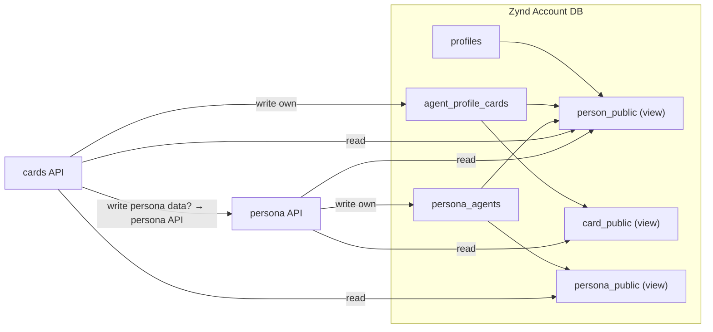

- One token is accepted everywhere. A cards page can show persona data (and the reverse) by reading a view or calling the owner's API.
- Views are the **contract**. A product can refactor its own tables as long as its views still return the same columns.
- Browser clients may query the views directly through supabase-js; RLS keyed on `auth.uid()` applies.

---

## 7. People search (**Later**, quick wins **Now**)

### 7.1 Quick wins (**Now**)
- **Cards search:** replace the Python scan over 1,000 rows with an SQL RPC ordered by `embedding <=> query` so the HNSW index is used. Keep the structured filters in the `WHERE` clause.
- **Persona:** the People page "similar" section and the cards directory call memory's existing `find_similar_users` / `find_people` as a second source.

### 7.2 Target design

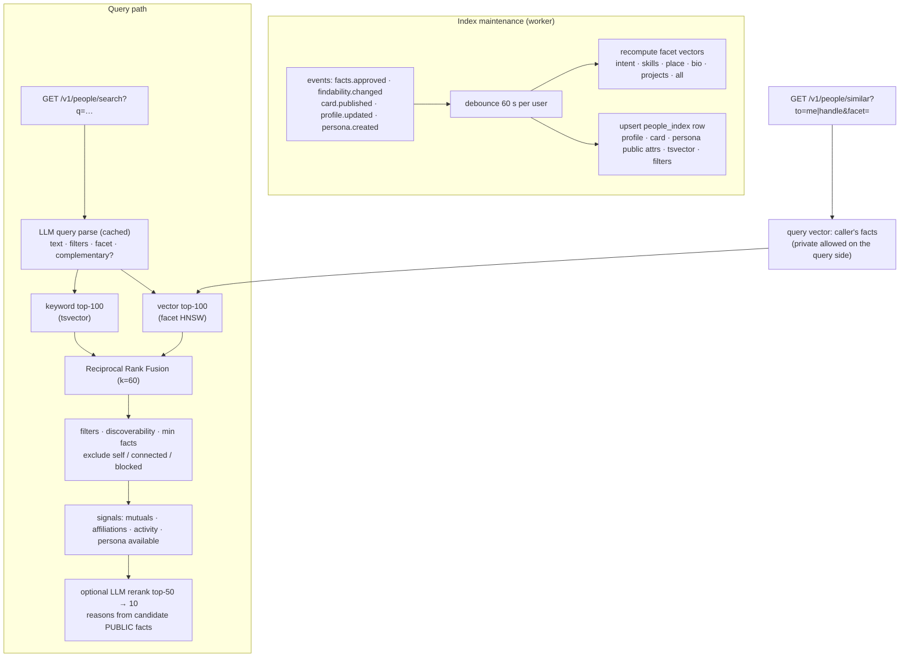

| Aspect | Design |
|---|---|
| **Privacy in one direction** | The query side may use the caller's full memory (built at request time, never stored). Candidates use only `is_public` facts (the existing `user_embeddings` rule). Gated predicates (health, politics, immigration) are excluded from both sides |
| **Facets** | Existing `intent_cluster`, `skill_cluster`, `place_cluster`, `full_context`, plus new `bio` and `projects` embedded from card text. Same model (`text-embedding-3-small`, 1536 dimensions) in cards and memory, stored in an `embedding_model` column |
| **Complementary matching** | `is_seeking: co_founder` ↔ `open_to: co_founder`. `being_mentored` ↔ `mentoring_others`. `early_users` ↔ `early_user_testing`. `peer_review` / `technical_feedback` ↔ `peer_review`. `collaboration` ↔ `collaboration`. `investment` ↔ expertise text "investor/angel/VC". All based on memory's `ENUM_VALUES` |
| **Hybrid retrieval** | Vector search for intent, keyword search for names, companies and exact skills, filters for location, `open_to` and availability. Fused with RRF, `score = Σ 1/(60 + rank)` |
| **Graph signals** | Mutual connections (bridge LinkedIn network, persona `dm_threads`), shared `is_affiliated_with`, recent activity, active persona agent |
| **Results** | handle, name, avatar, headline, card URL, `has_persona`, score, `reasons[]`, mutuals. **No vectors, no private facts** |
| **External tier** | Persona's QuickEnrich and memory's Exa/Tavily LinkedIn search return people not on Zynd, in a separate labeled section with an "Invite to Zynd" action |
| **Discoverability** | `profiles.discoverability`: `off` / `members` (default) / `public`. Anonymous search only sees `public` |
| **Abuse control** | Rate limits per user, key and IP. Result caps. Pagination limits. No bulk export |
| **Scale** | Partial HNSW index per facet (`WHERE cluster_type = …`). pgvector iterative scans for filtered queries. Scales comfortably to millions of people |
| **Quality** | Labeled pairs → recall@10 offline. Online: click-through, connect rate, "not relevant" feedback |

### 7.3 API (served by memory-layer)

| Endpoint | Auth | Purpose |
|---|---|---|
| `GET /v1/people/search?q=&location=&open_to=&facet=&limit=&cursor=` | user / `zk_` (`people.search`) / anonymous (public only) | Natural-language + filtered search |
| `GET /v1/people/similar?to=me\|<handle>&facet=&limit=` | user / `zk_` | Similar people |
| `GET /v1/people/complementary?need=<is_seeking value>` | user | People who offer what the caller seeks |
| `GET /v1/people/{handle}/why` | user | Reasons you match this person (public facts only) |
| MCP `find_people`, `find_similar_users` | OAuth / `zk_` | Thin wrappers over the same service functions |

---

## 8. Event model (**Next**)

### 8.1 Catalogue

| Event | Producer | Consumers | Payload (beyond envelope) |
|---|---|---|---|
| `account.created` | zynd-account trigger (in account DB outbox) | memory (pre-create user), analytics | `email_verified` |
| `account.deleted` | persona (owns deletion) | cards, memory | — |
| `profile.updated` | persona / cards (via `set_handle` / profile edits) | memory (display cache, people index), cards (card handle) | changed fields |
| `card.published` / `card.updated` | cards | memory (seed + bio/projects facets + people index) | card id, handle, public text fields |
| `persona.created` | persona | memory (`has_persona`), cards (show "Talk to my persona") | agent_id |
| `facts.approved` / `findability.changed` | memory | cards (snapshot), memory index (self) | predicates changed |
| `connection.added` | persona | memory (graph signals) | peer `zynd_uid` |

**Envelope:** `{event_id (uuid), type, version, occurred_at, subject (zynd_uid), producer, data}`

### 8.2 Transport

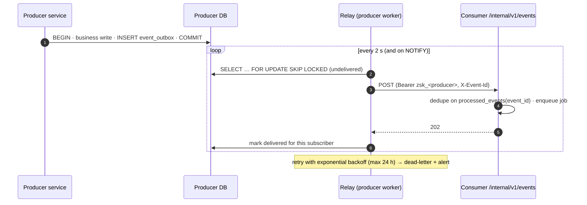

**Why signed HTTP instead of a shared broker:** the services run on different hosts, and Redis is internal to the api box. HTTP reuses the `zsk_` trust model. Redis Streams or NATS can replace it later without changing the envelope.

---

## 9. API surface summary

| Service | Public (user-facing) | Internal (service keys) |
|---|---|---|
| **cards** `api.zynd.ai` | `GET /cards`, `/cards/{id}`, `/cards/by-handle/{h}` (public) · `/cards/mine`, `PATCH /cards/by-handle/{h}`, `POST …/refresh-*` (self) · `/onboard/start`, `/onboard/{job}` (anonymous draft) · `POST /onboard/{job}/publish` (optional user; owner from token) · `/v1/agents/search`, `/v1/chat/{handle}`, `/ask` (public, rate-limited) | `POST /internal/v1/events` · `GET /internal/v1/cards/by-user/{uid}` |
| **persona** | `/api/persona/*`, `/api/meetings/*`, `/api/groups/*`, … (user / self / participant) · `/api/public/*`, `/api/pages/public/{slug}`, `/api/persona/{uid}/public`, `/api/groups/by-invite/{token}` (public) · `DELETE /api/account` (self, re-auth) | `/internal/v1/users/{uid}/persona`, `/profile`, `/brief`, `/todos`, `/threads`, `/agent-send`, `/connections`, `/meetings*`, `/pages`, `/provider-token/{provider}` (token broker), `/memberships/{product}` · `/internal/v1/people/batch` · `/internal/v1/personas/search` · `/internal/v1/events` |
| **memory** `api.zynd.ai` | `/me/*` (user / OAuth / `zk_`) · `/ingest` · `/mcp` · `/oauth/*` · `/me/api-keys` (session only) · `/v1/people/*` · `/pages/{slug}` (public, sandboxed) | `/v1/service/findability/{uid}` (`zsk_cards`) · `/internal/v1/events` |

**Common headers:**
- `Authorization: Bearer <session JWT | OAuth token | zk_ | zsk_>`
- `X-Zynd-User: <zynd_uid>` (obo only)
- `X-Request-Id` (propagated end to end)

**Error body:** `{"error": {"code": "…", "message": "…", "request_id": "…"}}`

---

## 10. Deployment topology

| Surface | Host | Notes |
|---|---|---|
| cards.zynd.ai (new) | Vercel (recommended) | Next.js. Env points at Zynd Account and api.zynd.ai |
| persona.zynd.ai | Persona host: pm2 `web` on :3001, `api` on :8000 (`ecosystem.config.js`) | Backend public via reverse proxy |
| api.zynd.ai | EC2 docker compose: Caddy, memory `api` :8000, `mcp` :8090, `worker`, Postgres (pgvector), Redis, `cards` :8000 | **Next:** move Caddyfile + compose into a `zynd-infra` repo. Each service ships its own image, deployed by tag |
| Zynd Account | Supabase (aafo…) | ES256 signing keys. Site URL cards.zynd.ai. Redirect allowlist: cards, persona, dev.persona, localhost |
| zynd.ai | Vercel + Supabase xmfj | Unchanged, apart from the cards removal and 301s |

**Caddy routing:**
- **Next:** keep the existing prefixes, but add `/internal/*` routes that are blocked at the edge unless the call arrives with a `zsk_` key. Service-to-service calls can also use the private network.
- **Later:** namespace per service (`/memory/v1/*`, `/cards/v1/*`) with the old paths kept as aliases.

**CORS:** memory and cards allow `https://cards.zynd.ai`, `https://persona.zynd.ai`, `https://dev.persona.zynd.ai` and localhost in development.

---

## 11. Non-functional requirements and observability

| Area | Target |
|---|---|
| Auth overhead | p95 < 5 ms per request (local JWKS; keys cached 1 h and re-fetched when an unknown `kid` appears) |
| Ingest latency | `/ingest` p95 < 200 ms (existing budget). `zk_` lookup via an indexed hash |
| Search latency | `/v1/people/search` p95 < 400 ms without rerank, < 1.5 s with rerank |
| Freshness | Approved fact → card updated in < 60 s. Card published → searchable in < 2 min |
| Availability | A Supabase Auth outage blocks only new logins. Event delivery survives consumer downtime (up to 24 h of retries) |
| Privacy | Private memory never leaves the memory DB. Search responses never include vectors or private facts |
| Observability | `X-Request-Id` on every hop. Structured JSON logs with `zynd_uid`, `service`, `route`, `credential_type`, `obo_by`. Metrics: auth failures by credential type, event lag, dead letters, search latency, funnel (`product_memberships`) |
| Security probes | CI job hitting every route with no token, another user's token and the wrong scope → expects 401/403 |

---

## 12. Rollout plan

| Phase | Scope | Exit criteria | Rollback |
|---|---|---|---|
| **Now: stabilize** | F1 route guards · F2 Telegram secret · F3 card owner · F6 connect code · F9/F10 memory contract fixes · F11 cards SQL search · F14 duplicate route · Zynd Account config (ES256, providers, allowlist) · staging · prod env audit | Probe: 0 unauthenticated user-scoped routes. Bridge contract test green. ES256 active | Guards can be flagged per router (not recommended) |
| **Next A: foundation** | `zynd-account` SQL + libraries · profiles backfill · handle reservations | Every aafo user has a profile. Libraries published | Drop the new tables (nothing depends on them yet) |
| **Next B: backends** | cards / persona / memory adopt `verify_session` · `zynd_uid` · legacy claim · `zsk_` keys · `/internal/v1/*` · API keys · single front door · events · card seeds memory | 7 days with no self-minted persona JWTs → rotate `JWT_SECRET`. No persona `service_role` in memory's env. Event path has replaced the cron | Credential resolver paths behind flags. Old paths stay until the exit gate |
| **Next C: frontends** | cards web app · persona cookie SSO · unified login · Connections + API keys pages · bridge `--api-key` · dashboard removal + 301s | SSO end to end. Old URLs 301 and are re-indexed. One login entry point | Keep dashboard cards routes deployable behind a flag until the 301s are verified |
| **Later** | People search · consent inbox · privacy center · ingestion worker · legacy cleanup · least-privilege roles · infra repo / monorepo | See Architecture §9 | per feature |
